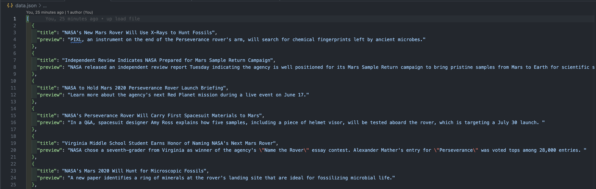

# Mission to Mars

## Purpose of the Challenge

Build an APP to scrape data from websites for the mission to Mars.
___
## Tools 

- splinter
- BeautifulSoup
- webdriver_manager
- pandas
- matplotlib
___
### Deliverable 1: Scrape Titles and Preview

In this deliverable we extract the news title and article teaser and save it in python dictionaries

___

### Deliverable 2: Scrape and Analyze Mars Weather Data

In this deliverable we extract the following data: 
- `terrestrial_date`: the date on Earth
- `sol`: the number of elapsed sols (Martian days) since Curiosity landed on Mars
-  `ls`: the solar longitude
-  `month`: the Martian month
- `min_temp`: the minimum temperature, in Celsius, of a single Martian day (sol)
- `pressure`: The atmospheric pressure at Curiosity's location

to analyze Mars's weather to which month is cold and which is hot and display it on a chart 
